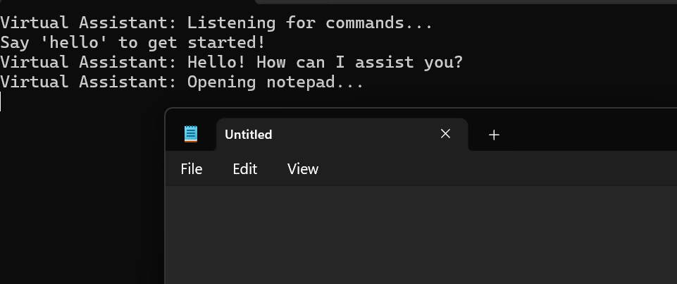
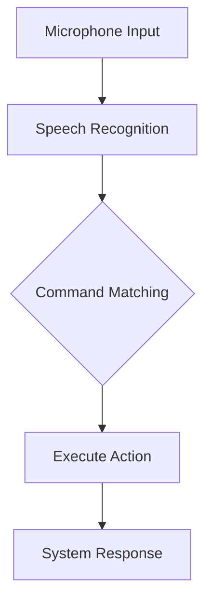

# 🎙️ Virtual Assistant 🤖


A sophisticated voice-controlled virtual assistant built with C# and Windows Speech Recognition.

✨ **Experience seamless voice control** for your basic computer tasks!

## 🌟 Features

| Command        | Description                | Emoji |
| -------------- | -------------------------- | ----- |
| `Hello`        | Initiate conversation      | 👋    |
| `Open Notepad` | Launch Notepad application | 📓    |
| `Exit`         | Terminate the assistant    | 🚪    |

- 🎯 **Voice Recognition**: Accurate command detection using System.Speech
- 💡 **Smart Feedback**: Interactive console responses
- 🛠️ **Error Handling**: Graceful exception management
- ⚡ **Quick Launch**: Instant application execution

## 🚀 Getting Started

### 📋 Prerequisites

- Windows 10/11
- .NET Framework 4.8+
- [Visual Studio 2022](https://visualstudio.microsoft.com/) (Recommended)
- Working microphone

### ⚙️ Installation

1. Clone the repository:
   ```bash
   git clone https://github.com/RlxChap2/VirtualAssistant.git
   ```
2. Open solution in Visual Studio:
   ```bash
   cd VirtualAssistant
   start VirtualAssistant.sln
   ```
3. Build the solution:
   ```bash
   MSBuild /t:Build /p:Configuration=Release
   ```

### 🎮 Usage

```bash
VirtualAssistant.exe
```

**Command Flow**:

1. Say "Hello" to activate
2. Try "Open Notepad"
3. "Exit" to quit


_(Consider adding actual screenshot later)_

## 🧠 Architecture



## 🛠️ Built With

- [System.Speech](https://docs.microsoft.com/en-us/dotnet/api/system.speech) - Microsoft's speech recognition API
- [.NET Framework](https://dotnet.microsoft.com/) - Runtime environment
- [Visual Studio](https://visualstudio.microsoft.com/) - IDE

## 🤝 Contributing

1. Fork the Project
2. Create your Feature Branch (`git checkout -b feature/AmazingFeature`)
3. Commit your Changes (`git commit -m 'Add some AmazingFeature'`)
4. Push to the Branch (`git push origin feature/AmazingFeature`)
5. Open a Pull Request

## 📜 License

Distributed under the MIT License. See `LICENSE` for more information.

## 📧 Contact

Project Link: [https://github.com/RlxChap2/VirtualAssistant](https://github.com/RlxChap2/VirtualAssistant)

---

Made with ❤️ and ☕ by [RlxChap2] | _"Your voice, our command"_
